```{r setup, include=FALSE}
knitr::opts_chunk$set(echo = FALSE)
```


# Content

* [1.0 Original Visualization]

* [2.0 Critic and Suggestion for current graph]
    + [2.1 Clarity]
    + [2.2 Aesthetics]

* [3.0 Proposed Design]

* [4.0 Data Preparation]
    + [4.1 Remove Unused Rows and Columns]
    + [4.2 Renaming Sheet]
    + [4.3 Drawing Relationship]
    + [4.4 Data Processing]

* [5.0 Building the Visualization]

* [6.0 Final Output]
    + [6.1 Insights]
    
***
# 1.0 Original Visualization

The data visualization below is created using the data provided by Department of Statistics, Singapore (DOS) on the Merchandise Trade by Region/Market. The visualization shows the value of import and export in Singapore with each trading partner represented by two areas on the visualization which represents higher proportion of either import or export value.


# 2.0 Critic and Suggestion for current graph

## 2.1 Clarity

  S/N |   Critic and Suggestion      
------|----------------------------
1     | **Main Highlight not shown on Visualization**: The highlight of the visualization compares the values of exports and imports for Singapore's merchandise trade with Mainland China in 2009 and United States in 2006 but it was not indicated on the visualization. The comparison can be made for the two countries on the same year 2006 or 2009 instead of comparing across two different years.
2.    | **Overlapping Data Points**: The size of the bubbles which was meant to reflect the total merchandised trade value with trading partners ended up overlapping with other data points. Notably, the plot for merchandised trade with japan can be seen covering a large portion of the data including the centre point for the Republic of Korea. Similar can be seen for EU, Malaysia and Taiwan. Transparency can be applied to the data points allow the centre point of other data to be seen in the event of an overlap.
3.    |**Unclear visualization for Top Import and Export**: The visualization showed that the top exporter was Hong Kong and top importer was Taiwan based on the labels. However, the total merchandised trade for both import and export was shown to be Mainland China based on the plot. The top importer and exporter should be labeled by year. Else, the overall net import and export value should be considered instead.
4.    |**Unoptimised use of Labels**: The labels for each data point could be better placed by setting it as tool tips indicating the individual export and import values for each trading partner. The labels could include the individual import and export values respectively.


## 2.2 Aesthetics

  S/N |   Critic and Suggestion      
------|----------------------------
1.    | **Data too cluttered**: The visualization is too cluttered with overlapping data points hence making it difficult to see the data points clearly like how the United States data was covering the EU data, together with some transparency for overlapping data points.
2.    | **Missing Axis Labels**: The major units are not shown on the import and export axis, making it hard for readers to read the major units. A faint grideline could be added into the chart to improve the visuals and allow readers to reference to the major units on the import and export axis
3.    | **Messy Plot Labels**: The labels for each trading partner are inconsistently placed on the chart with label for United States placed over the plot for EU and Taiwan. The Labels should be placed in a way that it is shown only when required (like placing the mouse cursor over the plot, or placed consistently below each plot itself.)


# 3.0 Proposed Design

Noting the weaknesses of the original design, the below design is proposed instead to address the weakness in Clarity and Aestatics.

.jpg)
*Figure 1. Proposed Design Sketch*


## Design Objective

  S/N |   Proposed Design Objective      
------|----------------------------
  1   | The proposed design intends to show the import against export for each country under a single chart for better clarity on the relative position, thus avoiding the issue of charts misalignment
  2   | The proposed design will show the import and export data for 2019 and 2020 separately to show the changes in relative position for each country from 2019 to 2020.
  3   | The proposed design will provide more details on the exact import and export values for each country for each year.


# 4.0 Data Preparation

The data is taken from the Department of Statistics, Singapore (DOS) on the Merchandise Imports and Exports by Region/Market.
The .xlsx file contains the import and export data for each trading partner split into worksheet T1 and T2 respectively.

## 4.1 Remove Unused Rows and Columns

As we are looking at the merchandised trade from Jan 2011 to Dec 2020, the below were removed.

  Steps |  Reference Image    
--------|------------------------------
Remove Top 5 Rows | .png)
Remove Footnote | 
Remove data from 1976 to 2010 | 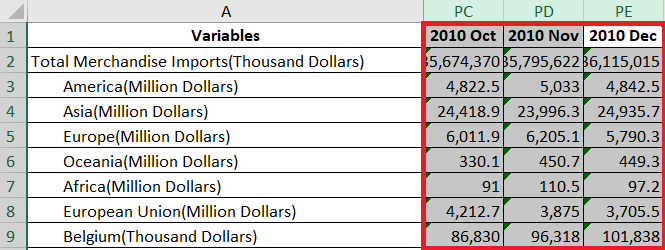
Remove data from 2021 | .png)


## 4.2 Renaming Sheet

For better clarity, the excel sheets for import and export were renamed accordingly. This is done so that it will be clearer when the data is imported into Tableau.


.PNG)
*Figure 6. Renaming the excel sheets*


## 4.3 Drawing Relationship

When the file was initially loaded onto Tableau, the import and export data will need to be linked using the common field "variable". In this case we link the *Variables* from both tables which represents each country. To do so, we click and drag the *Import* and *Export* Sheets into the top area as shown below and link .

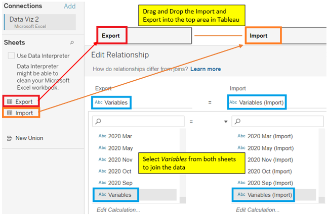
*Figure 7. Drawing Relationship by Trading Partners*


## 4.4 Data Processing

The data from 2011 to 2020 was pivoted to column form and tagged to the respective trading partners. The data types were changed to the correct data type and new calculated field was created to reflect the actual export value. The below steps were done for **both the import and export data**.


  Steps |  Reference Image    
:--------:|:------------------------------:
**Edit Data Type for Import and Export Values**|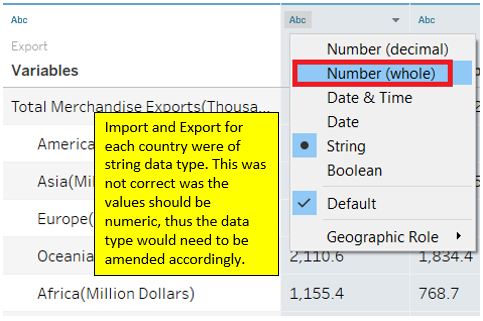

Pivot Data from 2011 to 2020|  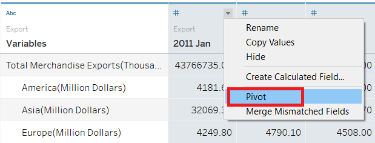
:--------:|:------------------------------:

Change Data Type of Month-Year from String to Date | 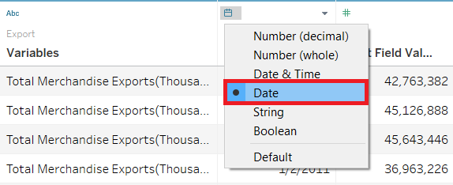
:--------:|:------------------------------:

Split Trading Partner Names and Units | 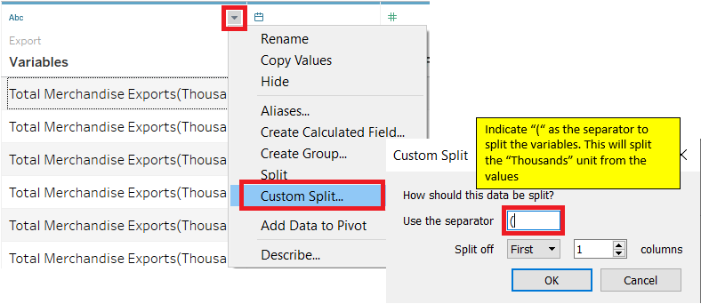 
:--------:|:------------------------------:

Create Calculated Field for Export Value | 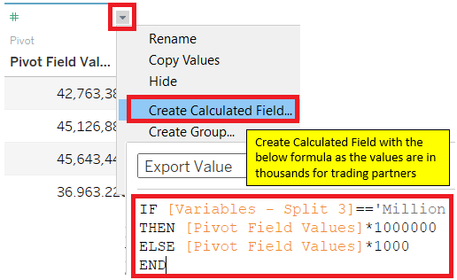
:--------:|:------------------------------:

Remove Unused Columns  | 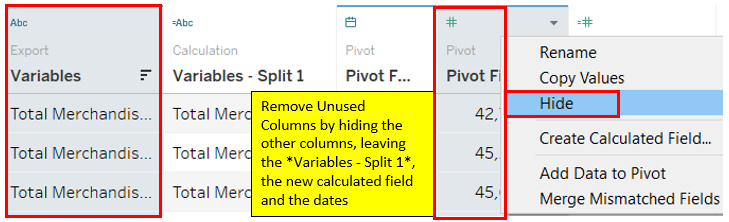
:--------:|:------------------------------:

Renamed Columns to better reflect the data | 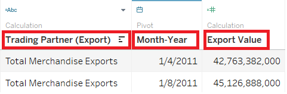
:--------:|:------------------------------:

Repeat above steps for Import Data | 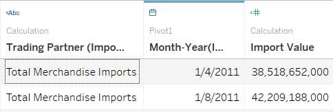
:--------:|:------------------------------:

Include the Month-Year variable in the relationship | 
:--------:|:------------------------------:


# 5.0 Building the Visualization

To create the proposed data visualization design, the below steps were taken. As we are interested to know the import and export for each trading partners individually, we exclude the values for the following :
1) Africa, 2) America, 3) Asia, 4) Europe, 5) European Union, 6) Oceania, 7) Total Merchandise Export, 8) Null. There were also trading partners with only import or export but not both (Example:New Caledonia,  Norfolk Island etc.). These trading partners will be excluded from the visualization.


  Steps      |  Reference Image    
:-------------:|:------------------------------:
**Plot the *Export Value* and *Import Value* with the *Trading Partners (Export)* as the level of details.**|

Apply filter to see the export and import value for each trading partner by years. | 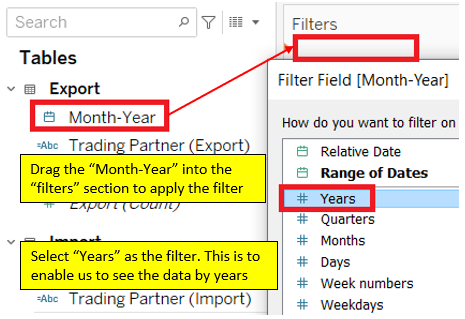
:--------:|:------------------------------:

Select all the years to be added into the filter.| 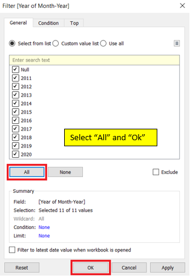
:--------:|:------------------------------:

Show filter to enable interactivity for the users on the right side of the dashboard/sheet.| 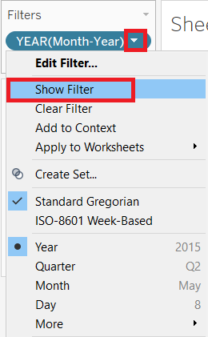
:--------:|:------------------------------:

On the right, a new tab will appear. Switch the filter type to *Single Value(list)*. | 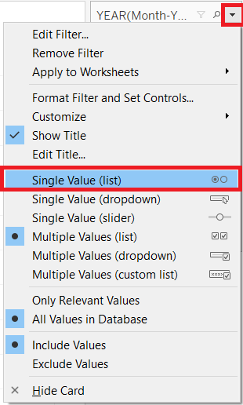
:--------:|:------------------------------:

Add Trading Partners into Filters to enable user input to filter data to his needs. (Example including/excluding regions into the analysis)| 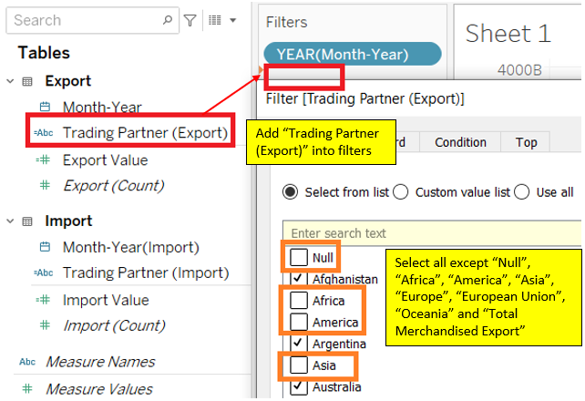
:--------:|:------------------------------:

Add Trading Partners into the Color. | 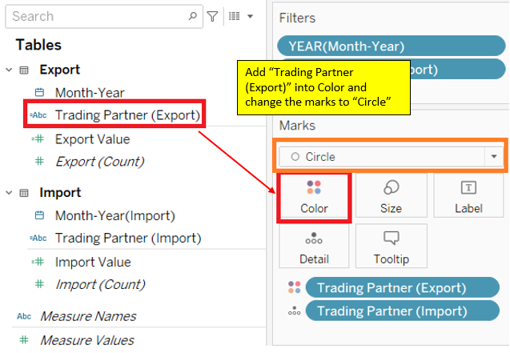
:--------:|:------------------------------:

Create a *Set* for top 10 Trading Partners for Export by Export Value.   *Repeat for Top 10 Import* | 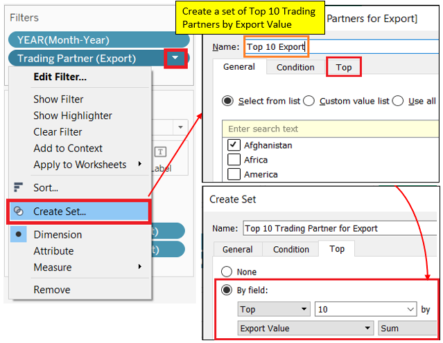
:--------:|:------------------------------:

Create a new Calculated Field *Total Trade* | 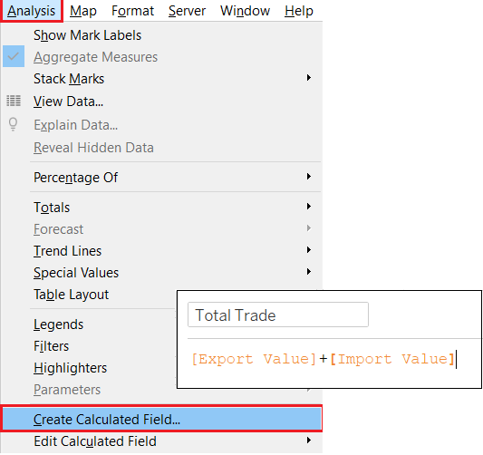
:--------:|:------------------------------:

Create a *Set* for top 10 Trading Partners in terms of total trade. | 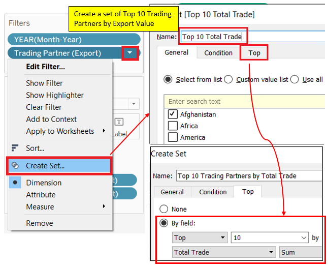
:--------:|:------------------------------:

Add the top 10 import and export trading partners into the filters and total trade vaue into the size. |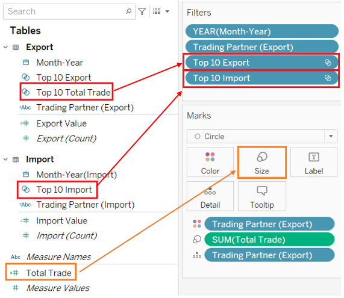
:--------:|:------------------------------:

Enable the option to see the set. Show filter after showing the set. |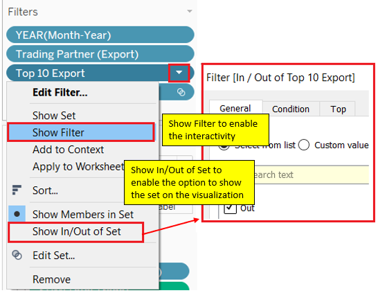
:--------:|:------------------------------:

Switch the filters to Single Value (ist) for the set for top 10 import/export. Leave the Trading Partner filter as multiple values (list) | 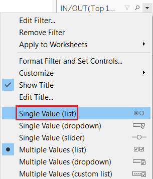
:--------:|:------------------------------:

Adding Ranking to Trading Partners | 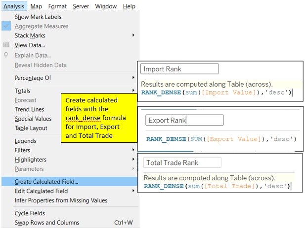
:--------:|:------------------------------:

Adding dimensions and measures into tooltip to be included in the write-up later. | 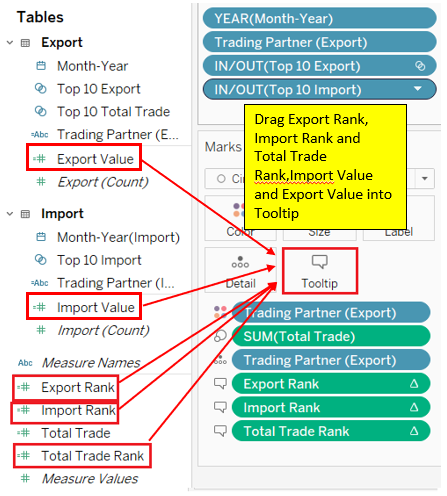
:--------:|:------------------------------:

Change the computation for ranking. Apply to import, export and total trade rank. |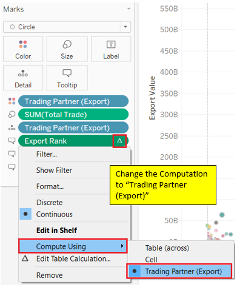
:--------:|:------------------------------:

Improving the Tooltips by adding more details relatng to the data. | 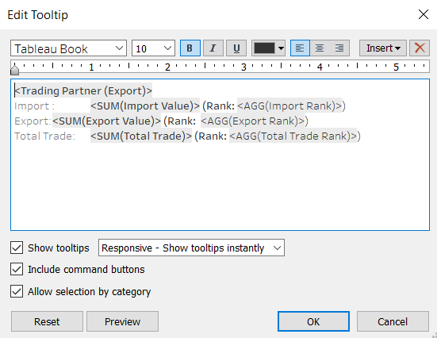
:--------:|:------------------------------:

Add Labels to improve clarity to the data poits. | 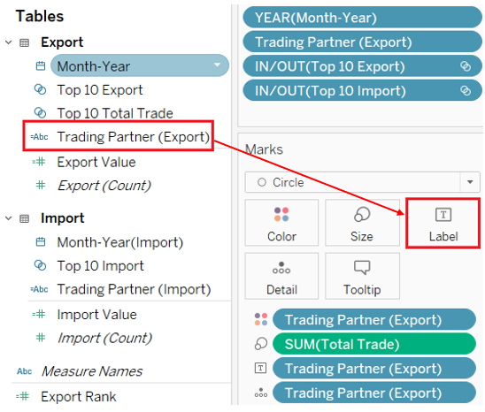
:--------:|:------------------------------:

Change the currency format for Total Trade, Import and Export to improve clarity on the values. | 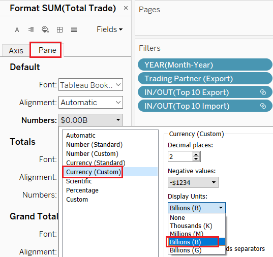
:--------:|:------------------------------:

Add Animation to the dashboard to improve user experience when applying filters | 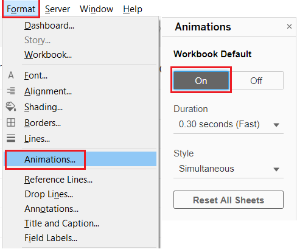
:--------:|:------------------------------:

Title of the chart was renamed to *Import vs Export of Trading Partner*. | 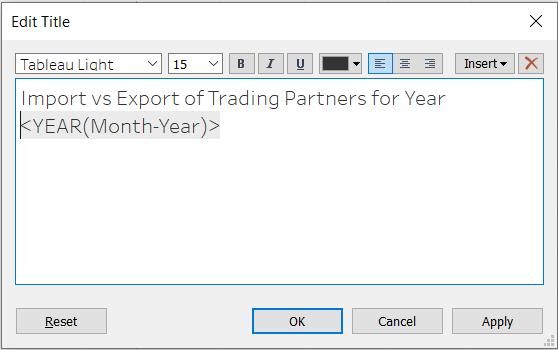
:--------:|:------------------------------:

Create another sheet and add box plot for additional information. Use only the Total Trade as the Row input. | 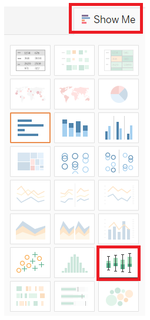
:--------:|:------------------------------:

Add Action to the Dashboard for interactivity between the newly created boxplot and the scatterplot. | 
:--------:|:------------------------------:


# 6.0 Final Output

With the set filters in place, there is an option to see the top 10 import or export trading partners. For the analysis, we exclude the regions and trading partners with only import or export and keep those with both export and import values.
We could also use the filter on the right to toggle the year to observe the import and export for each trading partner by year.

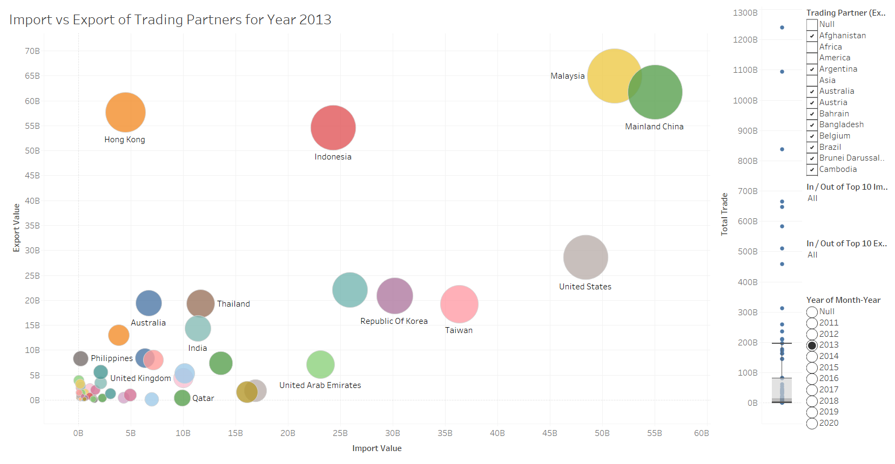

## 6.1 Insights

With the new Data Visualization, three major observations were made below.

  S/N |   Observations      
------|----------------------------
  1   |From year 2011 to 2012, Malaysia was the top Import and Export Partner for Singapore with a total Trade of **$113B** and **$115B** respectively. China was second place until year 2013 where CHina caught up with Malaysia in Total Trade and subsequently overtook Malaysia in being Singapore's top trading partner and maintained first place till year 2020.
  2   | Hong Kong was ranked consistently high in terms of **Export** with a yearly export value of above **$60B** but was consistently low on **Import** of approximately **$5B** .
  3   | The top 7 Trading Partners for both **Import** and **Export** are consistentthroughout the years namely, but not in order: 1) Malaysia, 2) china, 3) United States, 4) Japan, 5) Republic of Korea, 6) Taiwan, 7) Indonesia. For **Export**, Thailand, Austrailia and Hong Kong makes up the top 10, while for **Import**, Germany, United Arab Emirates and Saudi Arabia makes the top 10.

